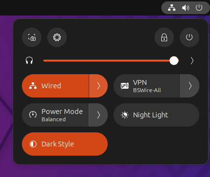
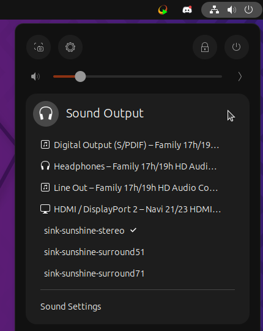
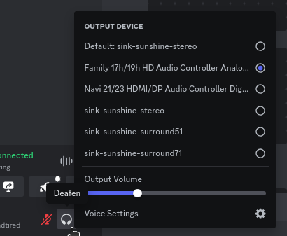
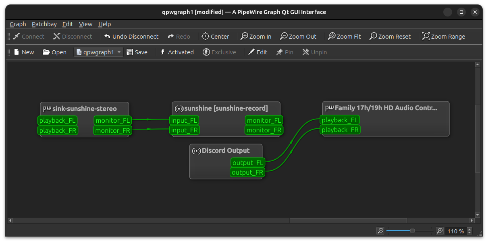
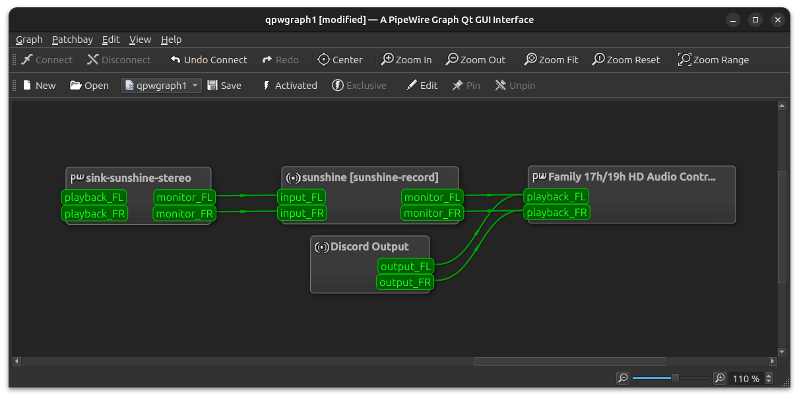

# Guides

@admonition{Community | This collection of guides is written by the community!
Feel free to contribute your own tips and trips by making a PR.}


## Linux

### Discord call cancellation

| Author     | [RickAndTired](https://github.com/RickAndTired) |
|------------|-------------------------------------------------|
| Difficulty | Easy                                            |

* Set your normal *Sound Output* volume to 100%

  

* Start Sunshine

* Set *Sound Output* to *sink-sunshine-stereo* (if it isn't automatic)

  

* In Discord, right click *Deafen* and select your normal *Output Device*.
  This is also where you will need to adjust output volume for Discord calls

  

* Open *qpwgraph*

  

* Connect `sunshine [sunshine-record]` to your normal *Output Device*
  * Drag `monitor_FL` to `playback_FL`
  * Drag `monitor_FR` to `playback_FR`

  

### Remote SSH Headless Setup

| Author     | [Eric Dong](https://github.com/e-dong) |
|------------|----------------------------------------|
| Difficulty | Intermediate                           |

This is a guide to setup remote SSH into host to startup X server and Sunshine without physical login and dummy plug.
The virtual display is accelerated by the NVidia GPU using the TwinView configuration.

@attention{This guide is specific for Xorg and NVidia GPUs. I start the X server using the `startx` command.
I also only tested this on an Artix runit init system on LAN.
I didn't have to do anything special with pulseaudio (pipewire untested).

Pipewire does not seem to work when Sunshine is started over an SSH session.
A workaround to this problem is to kill the Sunshine instance started via SSH, and start a new one
with the permissions of the desktop session. See [Autostart on boot without auto-login](#autostart-on-boot-without-auto-login)

Keep your monitors plugged in until the [Checkpoint](#checkpoint) step.}

@tip{Prior to editing any system configurations, you should make a copy of the original file.
This will allow you to use it for reference or revert your changes easily.}

#### The Big Picture
Once you are done, you will need to perform these 3 steps:

1. Turn on the host machine
2. Start Sunshine on remote host with a script that:

   * Edits permissions of `/dev/uinput` (added sudo config to execute script with no password prompt)
   * Starts X server with `startx` on virtual display
   * Starts Sunshine

3. Startup Moonlight on the client of interest and connect to host

@hint{As an alternative to SSH...

**Step 2** can be replaced with autologin and starting Sunshine as a service or putting
`sunshine &` in your `.xinitrc` file if you start your X server with `startx`.
In this case, the workaround for `/dev/uinput` permissions is not needed because the udev rule would be triggered
for "physical" login. See [Linux Setup](md_docs_2getting__started.html#linux). I personally think autologin compromises
the security of the PC, so I went with the remote SSH route. I use the PC more than for gaming, so I don't need a
virtual display everytime I turn on the PC (E.g running updates, config changes, file/media server).}

First we will [setup the host](#host-setup) and then the [SSH Client](#ssh-client-setup)
(Which may not be the same as the machine running the moonlight client).

#### Host Setup
We will be setting up:

1. [Static IP Setup](#static-ip-setup)
2. [SSH Server Setup](#ssh-server-setup)
3. [Virtual Display Setup](#virtual-display-setup)
4. [Uinput Permissions Workaround](#uinput-permissions-workaround)
5. [Stream Launcher Script](#stream-launcher-script)

#### Static IP Setup
Setup static IP Address for host. For LAN connections you can use DHCP reservation within your assigned range.
e.g. 192.168.x.x. This will allow you to ssh to the host consistently, so the assigned IP address does
not change. It is preferred to set this through your router config.

#### SSH Server Setup
@note{Most distros have OpenSSH already installed. If it is not present, install OpenSSH using your package manager.}

@tabs{
  @tab{Debian based | ```bash
    sudo apt update
    sudo apt install openssh-server
    ```}
  @tab{Arch based | ```bash
    sudo pacman -S openssh
    # Install  openssh-<other_init> if you are not using SystemD
    # e.g. sudo pacman -S openssh-runit
    ```}
  @tab{Alpine based | ```bash
    sudo apk update
    sudo apk add openssh
    ```}
  @tab{Fedora based (dnf) | ```bash
    sudo dnf install openssh-server
    ```}
  @tab{Fedora based (yum) | ```bash
    sudo yum install openssh-server
    ```}
}

Next make sure the OpenSSH daemon is enabled to run when the system starts.

@tabs{
  @tab{SystemD | ```bash
    sudo systemctl enable sshd.service
    sudo systemctl start sshd.service  # Starts the service now
    sudo systemctl status sshd.service  # See if the service is running
    ```}
  @tab{Runit | ```bash
    sudo ln -s /etc/runit/sv/sshd /run/runit/service  # Enables the OpenSSH daemon to run when system starts
    sudo sv start sshd  # Starts the service now
    sudo sv status sshd  # See if the service is running
    ```}
  @tab{OpenRC | ```bash
    rc-update add sshd  # Enables service
    rc-status  # List services to verify sshd is enabled
    rc-service sshd start  # Starts the service now
    ```}
}

**Disabling PAM in sshd**

I noticed when the ssh session is disconnected for any reason, `pulseaudio` would disconnect.
This is due to PAM handling sessions. When running `dmesg`, I noticed `elogind` would say removed user session.
In this [Gentoo Forums post](https://forums.gentoo.org/viewtopic-t-1090186-start-0.html),
someone had a similar issue. Starting the X server in the background and exiting out of the console would cause your
session to be removed.

@caution{According to this [article](https://devicetests.com/ssh-usepam-security-session-status)
disabling PAM increases security, but reduces certain functionality in terms of session handling.
*Do so at your own risk!*}

Edit the ``sshd_config`` file with the following to disable PAM.

```txt
usePAM no
```

After making changes to the `sshd_config`, restart the sshd service for changes to take effect.

@tip{Run the command to check the ssh configuration prior to restarting the sshd service.
```bash
sudo sshd -t -f /etc/ssh/sshd_config
```

An incorrect configuration will prevent the sshd service from starting, which might mean
losing SSH access to the server.}

@tabs{
  @tab{SystemD | ```bash
    sudo systemctl restart sshd.service
    ```}
  @tab{Runit | ```bash
    sudo sv restart sshd
    ```}
  @tab{OpenRC | ```bash
    sudo rc-service sshd restart
    ```}
}

#### Virtual Display Setup
As an alternative to a dummy dongle, you can use this config to create a virtual display.

@important{This is only available for NVidia GPUs using Xorg.}

@hint{Use ``xrandr`` to see name of your active display output. Usually it starts with ``DP`` or ``HDMI``. For me, it is ``DP-0``.
Put this name for the ``ConnectedMonitor`` option under the ``Device`` section.

```bash
xrandr | grep " connected" | awk '{ print $1 }'
```
}

```xorg
Section "ServerLayout"
   Identifier "TwinLayout"
   Screen 0 "metaScreen" 0 0
EndSection

Section "Monitor"
   Identifier "Monitor0"
   Option "Enable" "true"
EndSection

Section "Device"
   Identifier "Card0"
   Driver "nvidia"
   VendorName "NVIDIA Corporation"
   Option "MetaModes" "1920x1080"
   Option "ConnectedMonitor" "DP-0"
   Option "ModeValidation" "NoDFPNativeResolutionCheck,NoVirtualSizeCheck,NoMaxPClkCheck,NoHorizSyncCheck,NoVertRefreshCheck,NoWidthAlignmentCheck"
EndSection

Section "Screen"
   Identifier "metaScreen"
   Device "Card0"
   Monitor "Monitor0"
   DefaultDepth 24
   Option "TwinView" "True"
   SubSection "Display"
       Modes "1920x1080"
   EndSubSection
EndSection
```

@note{The `ConnectedMonitor` tricks the GPU into thinking a monitor is connected,
even if there is none actually connected! This allows a virtual display to be created that is accelerated with
your GPU! The `ModeValidation` option disables valid resolution checks, so you can choose any
resolution on the host!

**References**

* [issue comment on virtual-display-linux](https://github.com/dianariyanto/virtual-display-linux/issues/9#issuecomment-786389065)
* [Nvidia Documentation on Configuring TwinView](https://download.nvidia.com/XFree86/Linux-x86/270.29/README/configtwinview.html)
* [Arch Wiki Nvidia#TwinView](https://wiki.archlinux.org/title/NVIDIA#TwinView)
* [Unix Stack Exchange - How to add virtual display monitor with Nvidia proprietary driver](https://unix.stackexchange.com/questions/559918/how-to-add-virtual-monitor-with-nvidia-proprietary-driver)
}

#### Uinput Permissions Workaround

##### Steps
We can use `chown` to change the permissions from a script. Since this requires `sudo`,
we will need to update the sudo configuration to execute this without being prompted for a password.

1. Create a `sunshine-setup.sh` script to update permissions on `/dev/uinput`. Since we aren't logged into the host,
   the udev rule doesn't apply.
2. Update user sudo configuration `/etc/sudoers.d/<user>` to allow the `sunshine-setup.sh`
   script to be executed with `sudo`.

@note{After I setup the :ref:`udev rule <about/setup:install>` to get access to `/dev/uinput`, I noticed when I sshed
into the host without physical login, the ACL permissions on `/dev/uinput` were not changed. So I asked
[reddit](https://www.reddit.com/r/linux_gaming/comments/14htuzv/does_sshing_into_host_trigger_udev_rule_on_the).
I discovered that SSH sessions are not the same as a physical login.
I suppose it's not possible for SSH to trigger a udev rule or create a physical login session.}

##### Setup Script
This script will take care of any preconditions prior to starting up Sunshine.

Run the following to create a script named something like `sunshine-setup.sh`:

```bash
echo "chown $(id -un):$(id -gn) /dev/uinput" > sunshine-setup.sh && \
  chmod +x sunshine-setup.sh
```

(**Optional**) To Ensure ethernet is being used for streaming, you can block Wi-Fi with `rfkill`.

Run this command to append the rfkill block command to the script:

```bash
echo "rfkill block $(rfkill list | grep "Wireless LAN" \
  | sed 's/^\([[:digit:]]\).*/\1/')" >> sunshine-setup.sh
```

##### Sudo Configuration
We will manually change the permissions of `/dev/uinput` using `chown`.
You need to use `sudo` to make this change, so add/update the entry in `/etc/sudoers.d/${USER}`.

@danger{Do so at your own risk! It is more secure to give sudo and no password prompt to a single script,
than a generic executable like chown.}

@warning{Be very careful of messing this config up. If you make a typo, *YOU LOSE THE ABILITY TO USE SUDO*.
Fortunately, your system is not borked, you will need to login as root to fix the config.
You may want to setup a backup user / SSH into the host as root to fix the config if this happens.
Otherwise, you will need to plug your machine back into a monitor and login as root to fix this.
To enable root login over SSH edit your SSHD config, and add `PermitRootLogin yes`, and restart the SSH server.}

1. First make a backup of your `/etc/sudoers.d/${USER}` file.

   ```bash
   sudo cp /etc/sudoers.d/${USER} /etc/sudoers.d/${USER}.backup
   ```

2. `cd` to the parent dir of the `sunshine-setup.sh` script and take note of the full filepath.
3. Execute the following to edit your sudoer config file.

@danger{NEVER modify a file in ``sudoers.d`` directly. Always use the ``visudo`` command. This command checks your changes
before saving the file, and if the resulting changes would break sudo on your system, it will prompt you to fix
them. Modifying the file with nano or vim directly does not give you this sanity check and introduces the
possibility of losing sudo access to your machine. Tread carefully, and make a backup.}

```bash
sudo visudo /etc/sudoers.d/${USER}
```

Copy the below configuration into the text editor. Change `${USER}` wherever it occurs to your username
(e.g. if your username is `sunshineisaawesome` you should change `${USER}` to `sunshineisawesome`)
or modify the path if you placed `sunshine-setup.sh` in a different area.

```
${USER} ALL=(ALL:ALL) ALL, NOPASSWD: /home/${USER}/scripts/sunshine-setup.sh
```

These changes allow the script to use sudo without being prompted with a password.

e.g. `sudo $(pwd)/sunshine-setup.sh`

#### Stream Launcher Script
This is the main entrypoint script that will run the `sunshine-setup.sh` script, start up X server, and Sunshine.
The client will call this script that runs on the host via ssh.


##### Sunshine Startup Script
This guide will refer to this script as `~/scripts/sunshine.sh`.
The setup script will be referred as `~/scripts/sunshine-setup.sh`.

```bash
#!/bin/bash
set -e

export DISPLAY=:0

# Check existing X server
ps -e | grep X >/dev/null
[[ ${?} -ne 0 ]] && {
 echo "Starting X server"
 startx &>/dev/null &
 [[ ${?} -eq 0 ]] && {
   echo "X server started successfully"
 } || echo "X server failed to start"
} || echo "X server already running"

# Check if sunshine is already running
ps -e | grep -e .*sunshine$ >/dev/null
[[ ${?} -ne 0 ]] && {
 sudo ~/scripts/sunshine-setup.sh
 echo "Starting Sunshine!"
 sunshine > /dev/null &
 [[ ${?} -eq 0 ]] && {
   echo "Sunshine started successfully"
 } || echo "Sunshine failed to start"
} || echo "Sunshine is already running"

# Add any other Programs that you want to startup automatically
# e.g.
# steam &> /dev/null &
# firefox &> /dev/null &
# kdeconnect-app &> /dev/null &
```

#### SSH Client Setup
We will be setting up:

1. [SSH Key Authentication Setup](#ssh-key-authentication-setup)
2. [SSH Client Script (Optional)](#ssh-client-script-optional)

##### SSH Key Authentication Setup
1. Setup your SSH keys with `ssh-keygen` and use `ssh-copy-id` to authorize remote login to your host.
   Run `ssh <user>@<ip_address>` to login to your host.
   SSH keys automate login so you don't need to input your password!
2. Optionally setup a `~/.ssh/config` file to simplify the `ssh` command

   ```txt
   Host <some_alias>
       Hostname <ip_address>
       User <username>
       IdentityFile ~/.ssh/<your_private_key>
   ```

   Now you can use `ssh <some_alias>`.
   `ssh <some_alias> <commands/script>` will execute the command or script on the remote host.

##### Checkpoint
As a sanity check, let's make sure your setup is working so far!

###### Test Steps
With your monitor still plugged into your Sunshine host PC:

1. `ssh <alias>`
2. `~/scripts/sunshine.sh`
3. `nvidia-smi`

   You should see the Sunshine and Xorg processing running:

   ```bash
   nvidia-smi
   ```

   *Output:*
   ```txt
   +---------------------------------------------------------------------------------------+
   | NVIDIA-SMI 535.104.05             Driver Version: 535.104.05   CUDA Version: 12.2     |
   |-----------------------------------------+----------------------+----------------------+
   | GPU  Name                 Persistence-M | Bus-Id        Disp.A | Volatile Uncorr. ECC |
   | Fan  Temp   Perf          Pwr:Usage/Cap |         Memory-Usage | GPU-Util  Compute M. |
   |                                         |                      |               MIG M. |
   |=========================================+======================+======================|
   |   0  NVIDIA GeForce RTX 3070        Off | 00000000:01:00.0  On |                  N/A |
   | 30%   46C    P2              45W / 220W |    549MiB /  8192MiB |      2%      Default |
   |                                         |                      |                  N/A |
   +-----------------------------------------+----------------------+----------------------+

   +---------------------------------------------------------------------------------------+
   | Processes:                                                                            |
   |  GPU   GI   CI        PID   Type   Process name                            GPU Memory |
   |        ID   ID                                                             Usage      |
   |=======================================================================================|
   |    0   N/A  N/A      1393      G   /usr/lib/Xorg                                86MiB |
   |    0   N/A  N/A      1440    C+G   sunshine                                    293MiB |
   +---------------------------------------------------------------------------------------+
   ```

4. Check `/dev/uinput` permissions

   ```bash
   ls -l /dev/uinput
   ```

   *Output:*

   ```console
   crw------- 1 <user> <primary_group> 10, 223 Aug 29 17:31 /dev/uinput
   ```

5. Connect to Sunshine host from a moonlight client

Now kill X and Sunshine by running `pkill X` on the host, unplug your monitors from your GPU, and repeat steps 1 - 5.
You should get the same result.
With this setup you don't need to modify the Xorg config regardless if monitors are plugged in or not.

```bash
pkill X
```

##### SSH Client Script (Optional)
At this point you have a working setup! For convenience, I created this bash script to automate the
startup of the X server and Sunshine on the host.
This can be run on Unix systems, or on Windows using the `git-bash` or any bash shell.

For Android/iOS you can install Linux emulators, e.g. `Userland` for Android and `ISH` for iOS.
The neat part is that you can execute one script to launch Sunshine from your phone or tablet!

```bash
#!/bin/bash
set -e

ssh_args="<user>@192.168.X.X" # Or use alias set in ~/.ssh/config

check_ssh(){
  result=1
  # Note this checks infinitely, you could update this to have a max # of retries
  while [[ $result -ne 0 ]]
  do
    echo "checking host..."
    ssh $ssh_args "exit 0" 2>/dev/null
    result=$?
    [[ $result -ne 0 ]] && {
      echo "Failed to ssh to $ssh_args, with exit code $result"
    }
    sleep 3
  done
  echo "Host is ready for streaming!"
}

start_stream(){
  echo "Starting sunshine server on host..."
  echo "Start moonlight on your client of choice"
  # -f runs ssh in the background
  ssh -f $ssh_args "~/scripts/sunshine.sh &"
}

check_ssh
start_stream
exit_code=${?}

sleep 3
exit ${exit_code}
```

#### Next Steps
Congratulations, you can now stream your desktop headless! When trying this the first time,
keep your monitors close by incase something isn't working right.

@seealso{Now that you have a virtual display, you may want to automate changing the resolution
and refresh rate prior to connecting to an app. See
[Changing Resolution and Refresh Rate](md_docs_2app__examples#changing-resolution-and-refresh-rate)
for more information.}

### Autostart on boot without auto-login

| Author     | [MidwesternRodent](https://github.com/midwesternrodent) |
| ---------- | ------------------------------------------------------- |
| Difficulty | Intermediate                                            |

After following this guide you will be able to:
1. Turn on the Sunshine host via Moonlight's Wake on LAN (WoL) feature.
2. Have Sunshine initialize to the login screen ready for you to enter your credentials.
3. Login to your desktop session remotely, and have your pipewire audio and Sunshine tray icon work appropriately.

#### Specifications
This guide was created with the following software on the host:
1. OpenSSH server and client (both on the host machine)
2. Sunshine v2024.1003.1754422
3. Debian 12 w/ KDE Plasma, SDDM, Wayland (also tested through xorg), and pipewire for audio.

The host hardware that was used in developing this guide:
1. AMD 7900XTX
2. AMD Ryzen 7 7800X3D
3. 128GB DDR5 RAM
4. 4 displays in total. 2 1080p displays, 1 3440x1440 display, and 1 4k Roku TV which is used as the always-on display
for streaming. (could be subbed with a dummy plug).

If you have used this guide on any alternative hardware or software (including non-debian based distros)
please, feel free to modify this guide and keep it growing!

#### Caveats
1. When you login the machine will close your connection and you will have to reconnect. This is necessary due to an
issue similar to why the [Uinput Permissions Workaround](#uinput-permissions-workaround) is needed since SSH 
connections are not treated the same as graphical logins. This causes weirdness like sound not working through
pipewire, and the tray icon for Sunshine not appearing. To get around this, we need to close the SSH initiated Sunshine
service, and start a new Sunshine service with the permissions of the graphical desktop. Unfortunately, this closes the
connection and forces you to reconnect through Moonlight. There is no way around this to the best of my knowledge
without enabling auto-login.
3. This guide does not cover using virtual displays. If you are using Nvidia graphics,
see [Remote SSH Headless Setup](#remote-ssh-headless-setup). If you are using AMD hardware, let me know
if you find something or feel free to add it to this guide.
4. I haven't (yet) found a way to disable sleep on the login screen, so if you wait too long after starting your PC,
the display may go to sleep and Moonlight will have trouble connecting. Shutting down and using WoL works great
though.

@attention{This is definitely safer than enabling auto-login directly, especially for a dual-use PC that is not only
streamed via Moonlight, but is also used as a standard desktop. *However* I do not know the implications of having an
always running SSH client to the localhost on the same machine. It may be possible for someone with significant
knowledge and physical access to the machine to compromise your user account due to this always-running SSH session.
However, that's better than just having the desktop always available, or opening up SSH even just your LAN since this
guide specifically disables non-localhost connections, so I believe this is safer to use than auto-login for general
users. As always, your [threat model](https://en.wikipedia.org/wiki/Threat_model) may vary.}

#### Prerequisites
In [Remote SSH Headless Setup](#remote-ssh-headless-setup) complete the following sections.

1. [Static IP Setup](#static-ip-setup)
2. [SSH Server Setup](#ssh-server-setup)
3. [Virtual Display Setup](#virtual-display-setup)
4. [Uinput Permissions Workaround](#uinput-permissions-workaround)
5. [Stream Launcher Script](#stream-launcher-script)

@note{On a default Debian 12 install using KDE Plasma, you are using the Simple Desktop Display Manager (SDDM).
Even if you are logging in to a Wayland session, SDDM by default starts with an xorg session, so this script
does not need to be modified if you primarily use a Wayland session (the default) when you login.}

#### Instructions

##### Enable Wake on LAN

Wake on LAN (WoL) will allow you to send a magic packet to turn your PC on remotely. This is handled automatically by
Moonlight's "send wake on lan" option in the app but you do need to enable it on your host machine first. The
[instructions on the debian.org](https://wiki.debian.org/WakeOnLan#Enabling_WOL) site are a little hard to parse, so
I've simplified them below.

@note{This may not work on all deb based distributions. If you know of a better way for POP OS, Ubuntu, or another
debian based distro please feel free to edit the guide yourself, or let me know.}

First, find the name of your ethernet interface.

```bash
ip link show
```

When I run this command, these are the results I receive
```
1: lo: <LOOPBACK,UP,LOWER_UP> mtu 65536 qdisc noqueue state UNKNOWN mode DEFAULT group default qlen 1000  
   link/loopback 00:00:00:00:00:00 brd 00:00:00:00:00:00  
2: enp117s0: <BROADCAST,MULTICAST,UP,LOWER_UP> mtu 1500 qdisc fq_codel state UP mode DEFAULT group default qlen 1000  
   link/ether 9c:6b:00:59:33:c1 brd ff:ff:ff:ff:ff:ff
```

We can ignore the loopback interface, and I can see my ethernet interface is called `enp117s0`. You might see
wireless interfaces here as well but they can also be ignored.

@note{If your PC is only connected via Wi-Fi, it is still technically possible to get this working, but it is outside
the scope of this guide and requires more networking knowledge and a Wi-Fi chip that supports WoL. If this is your
first foray into linux, I'd recommend just getting a cable.}

Now I can install ethtool and modify my interface to allow Wake on LAN. For your use, replace `enp117s0` with whatever
the name of your ethernet interface is from the command `ip link show`

```bash
sudo apt update
sudo apt install ethtool
sudo ethtool -s enp117s0 wol g
```

##### SSH Client Setup
To start, we need to install an SSH client (which is different from the *server* in [Remote SSH Headless Setup](#remote-ssh-headless-setup))
on our machine if this not already done. Open a terminal and enter the following commands.

```bash
sudo apt update
sudo apt install openssh-client
```

Next we need to generate the keys we will use to connect to our SSH session. This is as simple as running the
following in a terminal:

```bash
ssh-keygen
```

and simply pressing enter through the default options. This will place a file called `id_rsa` and `id_rsa.pub`
in the hidden folder `~/.ssh/`. This is the default key used when this user initiates an SSH session.

Next, we'll copy that public key to the `~/.ssh/authorized_users` file. These are the public keys
allowed to access this machine over SSH, and will allow us to establish an SSH connection with this user
to the SSH server running on the localhost.

```bash
cat ~/.ssh/id_rsa.pub >> ~/.ssh/authorized_keys 
```

@tip{If you also want any other machines (e.g. a laptop or Steam Deck) to connect to your machine remotely over ssh,
be sure to generate a pubkey on that machine and append it to the authorized_keys file like we did above.}

###### SSH Server Modifications

We'll want to make a few modification to the SSH server on the Sunshine host, both for convenience and security.

Modify `/etc/ssh/sshd_config` with the following changes:

@tabs{
  @tab{nano | ```bash
    sudo nano /etc/ssh/sshd_config
    ```}
  @tab{vim | ```bash
    sudo vi /etc/ssh/sshd_config
    ```}
}

Find the line with `PasswordAuthentication` and make sure it is set to `no` (removed the `#` if present.
Then find the line `PubkeyAuthentication` and make sure it is set to `yes` and remove the `#` from the beginning
if present. When you're done you should have these two lines in your config somewhere.

```
PubkeyAuthentication yes
PasswordAuthentication no
```

@tip{Using publickey encryption for SSH connections significantly increases your protection against brute force
attacks, and protects you against a rogue machine pretending to be your SSH server and stealing your password.}

The next step is optional, but if you do not plan on connecting to your computer remotely via ssh and only have
installed SSH for the purposes of using Sunshine, it's a good idea to disable listening for remote SSH connections.
Do this by changing the following lines near the top of your ``sshd_config``:

```
#ListenAddress 0.0.0.0  
#ListenAddress ::
```

To the following:

```
ListenAddress 127.0.0.1
ListenAddress ::1
```

This will only allow SSH connections coming from your computer itself.

@tip{on some distributions, the maintainers have added some files in ``/etc/ssh/sshd_config.d/`` which are pulled into
your ``sshd_config``. These modifications can conflict with what we've just done. If you have any files in
``/etc/ssh/sshd_config.d/``, make sure they do not include any of the changes we've just made or you will experience
problems. If they do, you can comment out those lines by placing a ``#`` at their beginning, or delete the files safely
if you don't plan to use SSH for anything other than Sunshine.}

###### Quick Test and Accept Host Authenticity.

Next, let's reboot the machine and try to connect! Accept any warnings about the unidentified host at this time,
you'll never see those appear again unless something changes with your setup.

```bash
ssh $(whoami)@localhost
```

You should see a new login prompt for the machine you're already on, and when you type `exit` you should just see

```bash
logout
Connection to localhost closed.
```

##### Run sunshine-setup on boot over SSH

Thanks to [this comment from Gavin Haynes on Unix Stack exchange](https://unix.stackexchange.com/questions/669389/how-do-i-get-an-ssh-command-to-run-on-boot/669476#669476),
we can establish an SSH connection on boot to run the sunshine-setup script via a systemd service.

###### Disable default Sunshine services

These service files are sometimes overwritten when updating Sunshine with the .deb.
So we'll be making new ones and disabling the included service files for our purposes.

```
sudo sytstemctl disable sunshine
systemctl --user disable sunshine
```

@note{In order to disable the user service, you must be logged in to the graphical desktop environment and run the
command from a GUI terminal. You'll also likely need to approve a polkit request (a graphical popup that asks
for your password). Trying to disable the user service without being signed in to the graphical environment is a
recipe for pain, and is why ``sudo`` is not invoked on the second line in the command above.}

###### Create the autossh-sunshine-start script

@tabs{
  @tab{nano | ```bash
    sudo nano /usr/local/bin/autossh-sunshine-start
    ```}
  @tab{vim | ```bash
    sudo vi /usr/local/bin/autossh-sunshine-start
    ```}
}

Copy the below script to that location and replace `{USERNAME}` wherever it occurs with the username you created
the SSH public key for in the previous section.

```bash
#!/bin/bash
ssh -i /home/{USERNAME}/.ssh/id_rsa {USERNAME}@localhost
"/home/{USERNAME}/scripts/sunshine.sh"
```

@attention{This script uses the location of the script in [Stream Launcher Script](#stream-launcher-script).
Please complete that section before continuing.}

Once you've created the script, be sure to make it executable by running:

```bash
sudo chmod +x /usr/local/bin/autossh-sunshine-start
```

###### Create the autossh systemd service file

@tabs{
  @tab{nano | ```bash
    sudo nano /etc/systemd/system/autossh-sunshine.service
    ```}
  @tab{vim | ```bash
    sudo vi /etc/systemd/system/autossh-sunshine.service
    ```}
}

Copy and paste the below systemd file and save it to the location in the commands above.

```
[Unit]  
Description=Start sunshine over an localhost SSH connection on boot
Requires=sshd.service
After=sshd.service

[Service]
ExecStartPre=/bin/sleep 5
ExecStart=/usr/local/bin/autossh-sunshine-start
Restart=on-failure
RestartSec=5s

[Install]
WantedBy=multi-user.target
```

Make it executable, and enable the service when you're done.

```bash
sudo chmod +x /etc/systemd/system/autossh-sunshine.service
sudo systemctl start autossh-sunshine
sudo systemctl enable autossh-sunshine
```

This point is a good time for a sanity check, so restart your PC and try to sign in to your desktop via Moonlight.
You should be able to access the login screen, enter your credentials, and control the user session. At this point
you'll notice the reason for the next section as your audio will be non-functional and you won't see any tray icon
for Sunshine. If you don't care about audio (and maybe a couple other bugs you might encounter from time to time due
to the permissions difference between an SSH session and the desktop session), you can consider yourself finished at
this point!

@note{You might also notice some issues if you have multiple monitors setup (including the dummy plug), like the mouse
cursor not being on the right screen for you to login. We will address this in the last step of this guide. It requires
messing with some configs for SDDM.}

##### Getting the audio working

To get the audio (and tray icon, etc...) working we will create a systemd user service, that will start on a graphical
login, kill the autossh-sunshine system service, and start Sunshine just like the standard Sunshine service.
This service will also need to call the autossh-sunshine system service before it is stopped as the user service will
be killed when we log out of the graphical session, so we want to make sure we restart that SSH service so we don't
lose the ability to log back in if we need to.

@tabs{
  @tab{nano | ```bash
    sudo nano /usr/lib/systemd/user/sunshine-after-login.service
    ```}
  @tab{vim | ```bash
    sudo vi /usr/lib/systemd/user/sunshine-after-login.service
    ```}
}

Once again, copy the below service file into your text editor at the location above.

```
[Unit]  
Description=Start Sunshine with the permissions of the graphical desktop session
StartLimitIntervalSec=500
StartLimitBurst=5

[Service]  
# Avoid starting Sunshine before the desktop is fully initialized.
ExecStartPre=/usr/bin/pkill sunshine
ExecStartPre=/bin/sleep 5
ExecStart=/usr/bin/sunshine
ExecStopPost=/usr/bin/systemctl start autossh-sunshine

Restart=on-failure
RestartSec=5s

[Install]
WantedBy=xdg-desktop-autostart.target
```

Make it executable, and enable it.

```bash
sudo chmod +x /usr/lib/systemd/user/sunshine-after-login.service
systemctl --user enable sunshine-after-login
```

###### Polkit Rules for Sunshine User Service

Since this is being run with the permissions of the graphical session, we need to make a polkit modification to allow
it to call the system service autossh-sunshine when this user service is stopped, without prompting us for a password.

@tabs{
  @tab{nano | ```bash
    sudo nano /etc/polkit-1/rules.d/sunshine.rules
    ```}
  @tab{vim | ```bash
    sudo vi /etc/polkit-1/rules.d/sunshine.rules
    ```}
}

Once again, copy the below to the .rules file in your text editor.

```js
polkit.addRule(function(action, subject) {  
   if (action.id == "org.freedesktop.systemd1.manage-units" &&  
       action.lookup("unit") == "autossh-sunshine.service")  
   {  
       return polkit.Result.YES;  
   }  
})
```

###### Modifications to sudoers.d files

Lastly, we need to make a few modifications to the sudoers file for our users. Replace {USERNAME} below with your
username. You will be prompted to select either vi or nano for your editor if you've not used this command before,
choose whichever you prefer.

```
sudo visudo /etc/sudoers.d/{USERNAME}
```

@danger{NEVER modify a file in ``sudoers.d`` directly. Always use the ``visudo`` command. This command checks your changes
before saving the file, and if the resulting changes would break sudo on your system, it will prompt you to fix
them. Modifying the file with nano or vim directly does not give you this sanity check and introduces the
possibility of losing sudo access to your machine. Tread carefully, and make a backup.}

As always, copy and paste the below into your user's `sudoers.d` configuration. Replace {USERNAME} with your username,
and {HOSTNAME} with the name of your computer.

```
{USERNAME} {HOSTNAME} = (root) NOPASSWD: /home/{USERNAME}/scripts/sunshine-setup.sh
{USERNAME} {HOSTNAME} = (root) NOPASSWD: /bin/sunshine
{USERNAME} {HOSTNAME} = (root) NOPASSWD: /usr/bin/systemctl start autossh-sunshine
{USERNAME} {HOSTNAME} = (root) NOPASSWD: /usr/bin/systemctl --user start sunshine-after-login
# The below is optional, but will allow us to send trigger a shutdown with a sunshine prep command, if desired.
{USERNAME} {HOSTNAME} = (root) NOPASSWD: /usr/sbin/shutdown
```

Once again, restart your computer and do a quick test. Make sure you can connect to the PC to login and enter your
credentials. You should be booted out of the system, and then can reconnect a few seconds later to the logged-in
desktop session. You should see a tray icon for Sunshine, and the sound should be working (or you may need to manually
select the sunshine-sink at least the first time).

If you don't have multiple monitors, at this point you can consider yourself done!

##### Configuring the login screen layout for multiple monitors

This is not Sunshine specific, but is a frequent problem I had setting up Sunshine and thought it pertinent to add to
the guide. If you are using multiple monitors (even a single monitor with a dummy plug may have this problem) you
might notice the streamed login screen has one or more of the following problems:

1. The text is way too small to see (caused by a too-high resolution)
2. The mouse cursor is off on some other screen (caused by not mirroring the displays)
3. There are multiple login screens overlapping each other (caused by differing resolutions, and trying to mirror
the display).

###### Log in to an X11 Session

This can be fixed, by modifying some scripts called by SDDM on boot. To start though, we need to make sure we're
logged into an x11 session, not Wayland or the terminal. As the Wayland session will give us incorrect information,
and the terminal will give us no information since no graphical environment exists. SDDM initially starts an x11
session to display the login screen so we need to use xorg commands to change the display configuration.

To do this, log out of your desktop session on the Sunshine host, and somewhere on the lower left of your screen
(depending on your SDDM theme) there will be some text that on Debian 12 KDE Plasma defaults to saying
`Session: Plasma (Wayland)`. Select this and choose `Plasma (X11)` from the drop down menu and sign in.

###### Find your monitor identifiers.

Open a terminal and run:

```bash
xrandr | grep -w connected
```

This will require some more sleuthing on your part. Different PC hardware, and different monitors / connectors,
display the names differently. Some start at 0, some start 1. Some spell out "DisplayPort" some, say "DP". You will
need to modify all of the commands from here on out based on the output of the above command. I will use the output I
receive below as the example for the rest of this guide.

```bash
DisplayPort-0 connected (normal left inverted right x axis y axis)  
DisplayPort-1 connected (normal left inverted right x axis y axis)
DisplayPort-2 connected (normal left inverted right x axis y axis)
HDMI-A-0 connected primary 1920x1080+0+0 (normal left inverted right x axis y axis) 800mm x 450mm
```

@note{If I instead run this command on Wayland, I get the following useless output. Hence the need to sign in to an
x11 session.

```bash
XWAYLAND0 connected 2592x1458+6031+0 (normal left inverted right x axis y axis) 600mm x 340mm
XWAYLAND1 connected 2592x1458+0+0 (normal left inverted right x axis y axis) 480mm x 270mm
XWAYLAND2 connected primary 3440x1440+2592+0 (normal left inverted right x axis y axis) 800mm x 330mm
XWAYLAND3 connected 2592x1458+0+0 (normal left inverted right x axis y axis) 1440mm x 810mm

```
}


From this, you can see that my monitors are named the following under an x11 session.

DisplayPort-0
DisplayPort-1
DisplayPort-2
HDMI-A-0

@tip{If you have a label maker, now would be a good time to unplug some cables, determine where they are on your
system, and label the outputs on your graphics card to ease changing your setup in the future.}

In my setup, after moving some inputs I changed my system so that these cables correspond to the below monitors

| Display Name  | Monitor                     |
| ------------- | --------------------------- |
| DisplayPort-0 | rightmost 1080p display     |
| DisplayPort-1 | leftmost 1080p display      |
| DisplayPort-2 | middle 3440x1440 display    |
| HDMI-A-0      | 4k Roku TV (and dummy plug) |

###### Modify the SDDM startup script

For my purposes, I would prefer to have the Roku TV (which doubles as my always-on dummy plug) to always display a
1080p screen on login (this can be changed automatically after login). And I would like to retain the ability to use
my leftmost monitor to login to my physical desktop, but I'd like to disable my primary and rightmost displays.

To do this, we need to modify the SDDM startup script to shut off DisplayPort-1 and DisplayPort-2, set HDMI-A-0 to
1080p and mirror it with DisplayPort-1.

@tabs{
  @tab{nano | ```bash
    sudo nano /usr/share/sddm/scripts/Xsetup
    ```}
  @tab{vim | ```bash
    sudo vi /usr/share/sddm/scripts/Xsetup
    ```}
}

Which will open a script that looks like this. We will not be removing these lines.

```bash
#!/bin/sh  
# Xsetup - run as root before the login dialog appears  
  
if [ -e /sbin/prime-offload ]; then  
   echo running NVIDIA Prime setup /sbin/prime-offload  
   /sbin/prime-offload  
fi
```

At the bottom of this Xsetup script though, we can add some xrandr commands

To shut a display off, we can use:  `xrandr --output {DISPLAYNAME} --off`.

To set a display as the primary and accept
it's automatic (usually the maximum, but not always especially on TVs where the default refresh rate may be lower) 
resolution and refresh rate we can use: `xrandr --output {DISPLAYNAME} --auto --primary`. 

To set a display to a specific resolution we can use: `xrandr --output {DISPLAYNAME} --mode {PIXELWIDTH}x{PIXELLENGTH}`. 

And lastly, to mirror a display we can use: `xrandr --output {DISPLAYNAME} --same-as {ANOTHER-DISPLAY}`

So with my desire to mirror my TV and left displays, my Xsetup script now looks like this:

```bash
#!/bin/sh  
# Xsetup - run as root before the login dialog appears  
  
if [ -e /sbin/prime-offload ]; then  
   echo running NVIDIA Prime setup /sbin/prime-offload  
   /sbin/prime-offload  
fi  
  
xrandr --output DisplayPort-0 --off  
xrandr --output DisplayPort-2 --off  
xrandr --output DisplayPort-1 --auto --primary  
xrandr --output HDMI-A-0 --mode 1920x1080  
xrandr --output HDMI-A-0 --same-as DisplayPort-1
```

Save this file, reboot, and you should see your login screen now respects these settings. Make sure when you log
back in, you select a Wayland session (if that is your preferred session manager).

#### Next Steps

Congratulations! You now have Sunshine starting on boot, you can login to your session remotely, you get all the
benefits of the graphical session permissions, and you can safely shut down your PC with the confidence you can
turn it back on when needed.

@seealso{As Eric Dong recommended, I'll also send you to automate changing your displays.
You can add multiple commands, to turn off, or configure as many displays as you'd like with the sunshine prep
commands. See [Changing Resolution and Refresh Rate](md_docs_2app__examples#changing-resolution-and-refresh-rate)
for more information and remember that the display names for your prep commands, may be different than what you
found for SDDM.}


## macOS
@todo{It's looking lonely here.}


## Windows

| Author     | [BeeLeDev](https://github.com/BeeLeDev) |
|------------|-----------------------------------------|
| Difficulty | Intermediate                            |

### Discord call cancellation
Cancel Discord call audio with Voicemeeter (Standard)

#### Voicemeeter Configuration
1. Click "Hardware Out"
2. Set the physical device you receive audio to as your Hardware Out with MME
3. Turn on BUS A for the Virtual Input

#### Windows Configuration
1. Open the sound settings
2. Set your default Playback as Voicemeeter Input

@tip{Run audio in the background to find the device that your Virtual Input is using
(Voicemeeter In #), you will see the bar to the right of the device have green bars
going up and down. This device will be referred to as Voicemeeter Input.}

#### Discord Configuration
1. Open the settings
2. Go to Voice & Video
3. Set your Output Device as the physical device you receive audio to

@tip{It is usually the same device you set for Hardware Out in Voicemeeter.}

#### Sunshine Configuration
1. Go to Configuration
2. Go to the Audio/Video tab
3. Set Virtual Sink as Voicemeeter Input

@note{This should be the device you set as default previously in Playback.}

<div class="section_buttons">

| Previous                        |                                        Next |
|:--------------------------------|--------------------------------------------:|
| [App Examples](app_examples.md) | [Performance Tuning](performance_tuning.md) |

</div>

<details style="display: none;">
  <summary></summary>
  [TOC]
</details>
