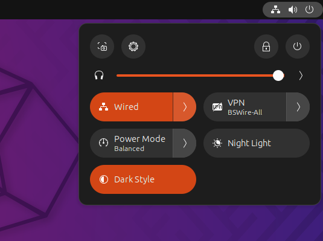
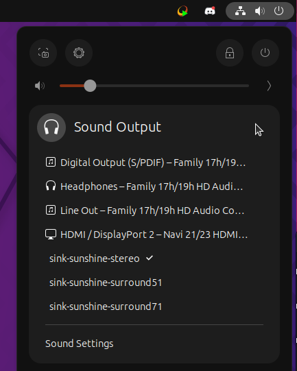
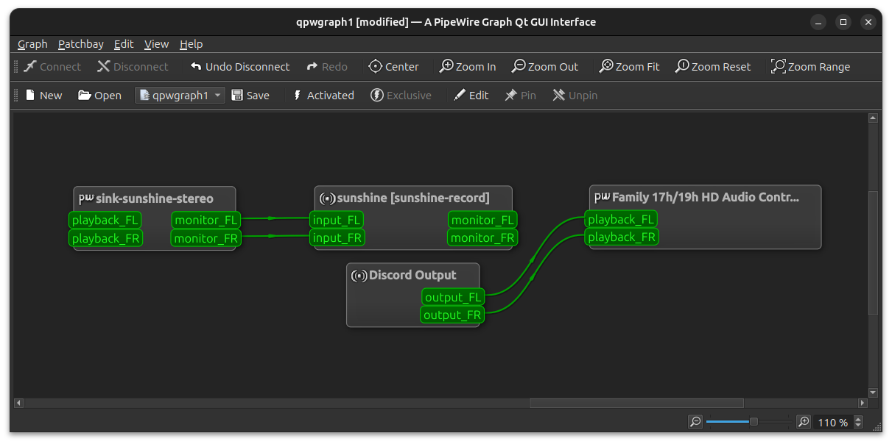
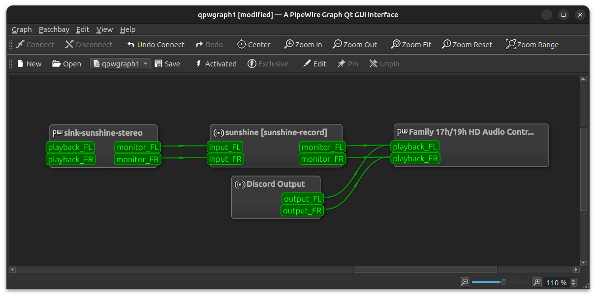

How to not stream Discord call audio
====================================

* Set your normal `Sound Output` volume to 100%

* Start Sunshine

* Set `Sound Output` to `sink-sunshine-stereo` (if it isn't automatic)

* In Discord - `Right Click` - `Deafen` - Select your normal `Output Device`

    This is also where you will need to adjust output volume for Discord calls

.. image:: ../../../images/discord_calls_3.png

* Open `qpwgraph`

You want to connect `sunshine [sunshine-record]` to your normal `Output Device`

* Drag `monitor_FL` to `playback_FL`

* Drag `monitor_FR` to `playback_FR`

